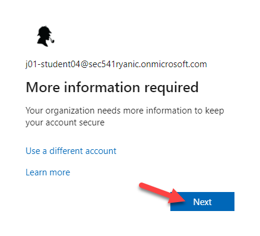
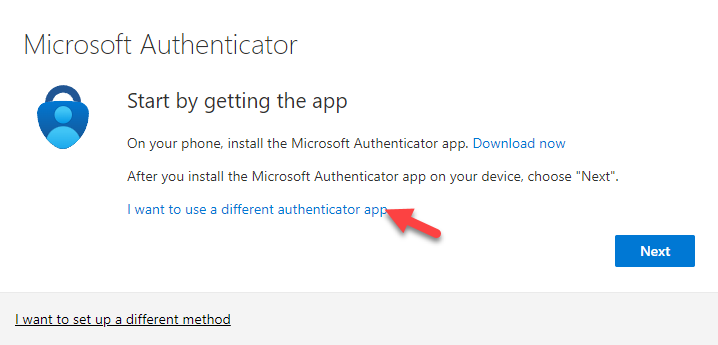
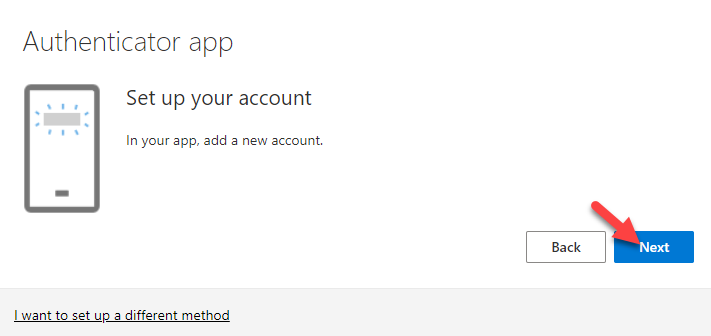
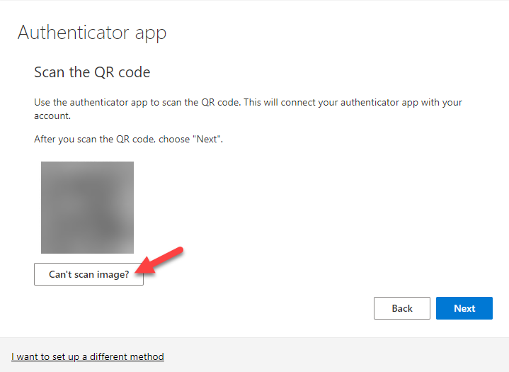
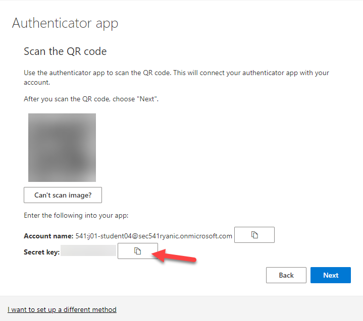
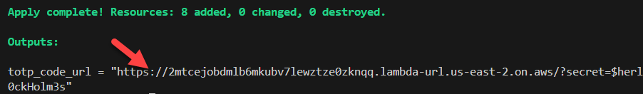
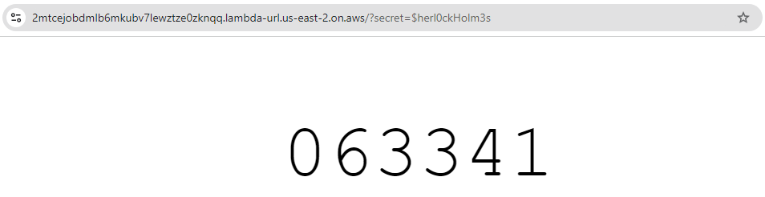
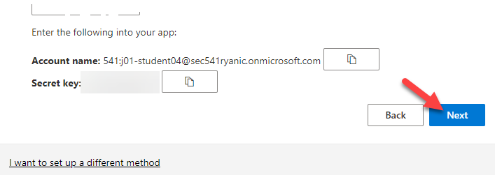
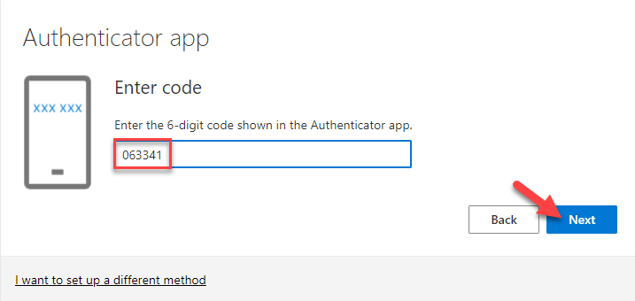
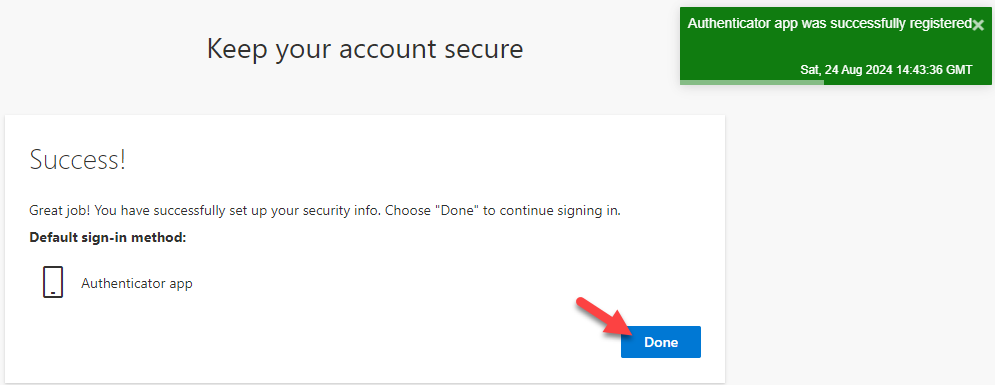

# SANS TOTP PoC

This is a proof of concept for the SANS TOTP project. It is a simple implementation of the TOTP algorithm in Python and deployed to AWS Lambda.

## Usage

1. Clone this repository.

2. In the `code/lambda_layer` directory, create a virtual environment, activate it, and install the dependencies with `pip install -r requirements.txt`.

    ```bash
    cd code/lambda_layer
    python3 -m venv venv
    source venv/bin/activate
    pip install -r requirements.txt
    deactivate
    ```

3. Attempt to sign into the Azure Portal using an account with MFA-enforced and click **Next** when prompted.

    

4. Click on the **I want to use a different authenticator app** link.

    

5. On the next page, click **Next** when prompted to set up your account.

    

6. When presented with a QR code, click on the **Can't scan image?** button.

    

7. Copy the **Secret key** value by clicking on the **clipboard icon**. Keep this tab open and return to the terminal.

    

8. Deploy the Terraform code as shown below.

    - During this process, you will be prompted to enter the secret key value. Paste or type the secret key value and press **Enter** (you will not see feedback as this value is marked `sensitive` in the Terraform code).

    - You will also be prompted if you would like to continue. Type `yes` and press **Enter**.

    ```bash
    terraform init
    terraform apply
    ```

9. After the Terraform code has been deployed, visit the URL shown in the Terraform output in a new tab. Leave this tab open for now.

    

    

10. Go back to the Azure Portal and click **Next**.

    

11. You will now be prompted to enter a 6-digit code. Refresh the page that you opened in step 9 and copy the code that is displayed.

    

12. Paste the code into the Azure Portal and click **Next**.

    

13. You should see that the MFA enrollment was successful. Click **Done** to complete this process.

    
